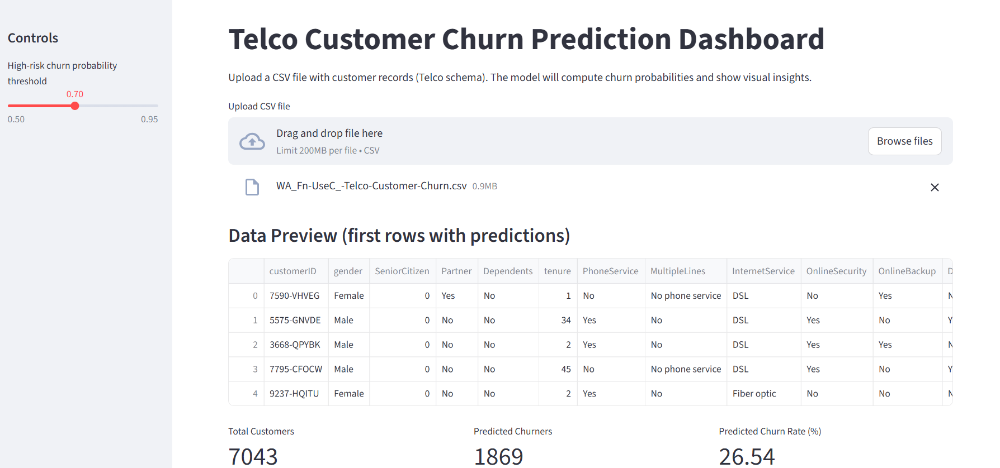
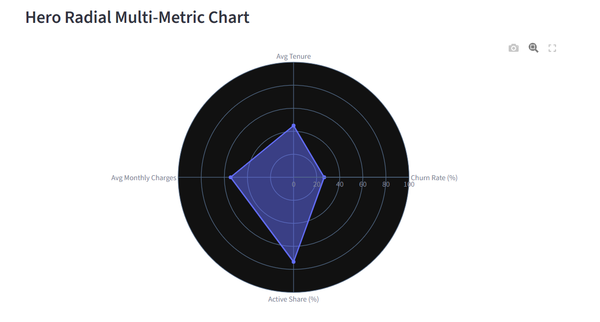
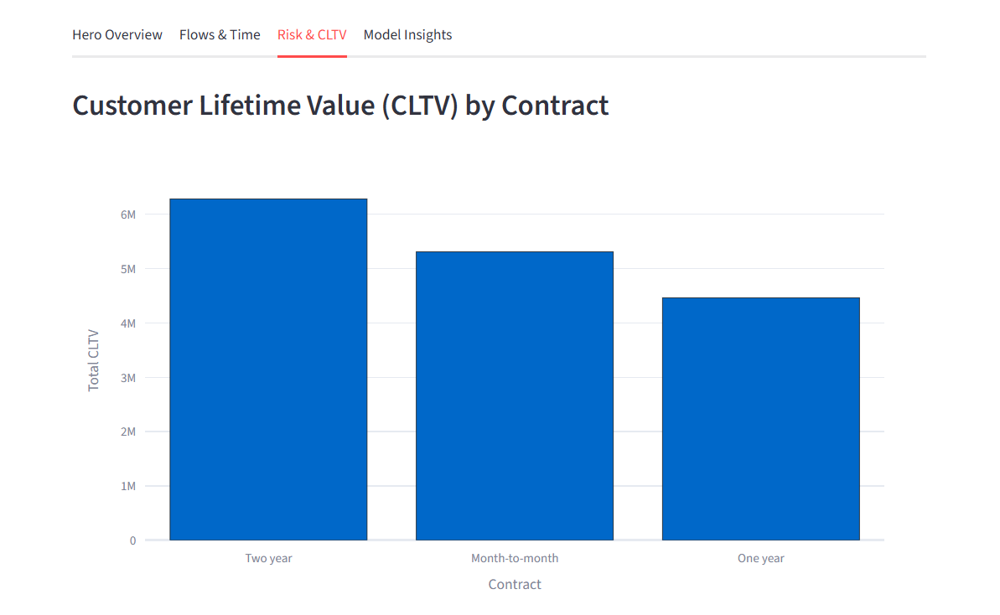
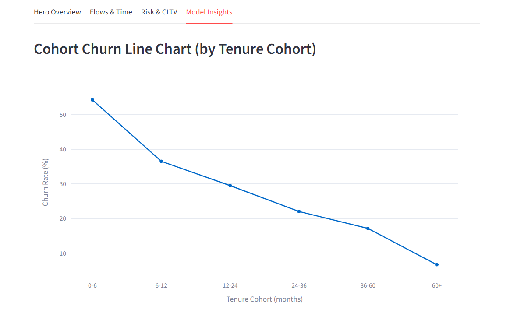
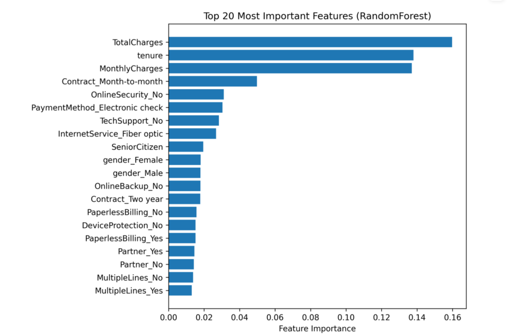
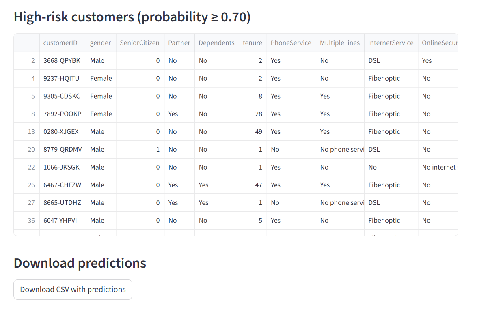

# 📊 Customer Churn Prediction – ML Model + Streamlit Dashboard

### 🔗 Live Demo  
👉 **Streamlit App:** https://customer-churn-predication-model-6adzfnglpkmuurvt8yarwv.streamlit.app/

This project predicts **Customer Churn** using machine learning and provides a **fully interactive Streamlit dashboard** that allows users to upload telecom customer data and generate insights instantly.

It is designed as an **industry-style ML pipeline** with clean preprocessing, model training, evaluation, and visual explainability.

---

# 📁 Dataset Used

**Telco Customer Churn Dataset (Kaggle):**  
https://www.kaggle.com/datasets/blastchar/telco-customer-churn

- **Rows:** 7,043  
- **Target:** `Churn` (Yes/No)  
- **Features:** Customer demographics, subscription pattern, contract type, services used, billing info, tenure, charges.

This dataset is widely used for churn prediction research and telecom analytics.

---

# 🚀 Features of This Project

### ✔ Machine Learning Pipeline
- Clean preprocessing with `ColumnTransformer`
- Handling of categorical & numerical features
- Missing value treatment
- Robust model: **RandomForestClassifier**
- Feature importance visualization

### ✔ Interactive Streamlit Dashboard
Includes powerful visualizations:
- Hero radial metric chart  
- Churn vs Non-Churn donut  
- Contract → Churn Sankey flow  
- Animated churn race by tenure & gender  
- Customer Lifetime Value (CLTV)  
- Risk heatmap (Contract × InternetService)  
- Tenure-based cohort churn line chart  
- High-risk customer filtering  
- Downloadable predictions

### ✔ Explainability
- Feature Importance plot (RandomForest)

---

# 🧠 ML Pipeline Overview

### **1. Preprocessing**
- Remove whitespace  
- Convert numeric-like columns (`TotalCharges`, `MonthlyCharges`, `tenure`)  
- One-hot encode categorical features  
- Scale numeric features  
- Impute missing values (median / most frequent)

### **2. Model**
- `RandomForestClassifier(n_estimators=300)`
- Trained via sklearn Pipeline

### **3. Evaluation**
- Accuracy
- ROC-AUC
- Confusion matrix (in training script)

### **4. Deployment**
- Hosted on Streamlit Community Cloud  
- Light training-on-start fallback for compatibility

---

# 📂 Project Structure
```
Customer-Churn-Predication-Model/
│
├── data/
│ └── WA_Fn-UseC_-Telco-Customer-Churn.csv
│
├── models/
│ └── telco_churn_model.pkl # (optional on cloud)
│
├── src/
│ ├── preprocess.py # preprocessing functions
│ ├── train_model.py # model training
│ ├── explain_model.py # feature importance plot
│ └── init.py
│
├── plots/
│ └── shap_summary_bar.png # feature importance chart
│
├── dashboard/
│ └── streamlit_app.py # main dashboard app
│
├── requirements.txt
└── README.md

```
---

# 🏃 How to Run Locally

### **1. Clone the repository**
```bash
git clone https://github.com/akshita-guptaa/Customer-Churn-Predication-Model
cd Customer-Churn-Predication-Model
```
### **2. Install dependencies**
```bash
pip install -r requirements.txt
```
### **3. Train the model (optional)**
```bash
python src/train_model.py
```
### **4. Run the Streamlit dashboards**
```bash
streamlit run dashboard/streamlit_app.py
```
---
# 📸 Dashboard Preview

### 🏠 Main Dashboard


### 📊 Radial Metrics 


### 🔗 Contract → Churn Sankey Flow


### 🔥CLTV


### 📈 Cohort Churn Line Chart


### ⭐ Feature Importance


### 🚨 High-Risk Customer Detection
Automatically identifies customers with churn probability ≥ selected threshold.


---
# 🏢 Business Use Case & Impact

This churn prediction model can support **telecom customer retention teams** by:

- Identifying customers with **high churn probability**
- Prioritizing outreach based on **CLTV (Customer Lifetime Value) × Churn Risk**
- Understanding **drivers of churn** through the dashboard visuals and patterns
- Designing targeted retention strategies:
  - Discounts or offers for long-tenure, high-risk users  
  - Personalized communication for specific customer segments  
  - Early detection of users at risk based on contract type, internet service, and billing method  

By predicting churn before it happens, the model can potentially **save significant revenue**, reduce customer turnover, and help the telecom business improve long-term loyalty.

---
# 📊 Model Evaluation Results

The RandomForest-based churn model is evaluated on a held-out test split of the Telco Customer Churn dataset.

### Classification Metrics

| Metric        | Value   |
|--------------|---------|
| Accuracy     | 78.35 % |
| Precision    | 61.94 % |
| Recall       | 47.77 % |
| F1-score     | 53.91 % |
| ROC–AUC      | 82.00 % |

> These values are computed in `src/train_model.py` using `scikit-learn` metrics on the test set.  
> If you retrain the model with different parameters or a different random seed, the numbers may change slightly.

### **Confusion Matrix**

|               | Predicted No | Predicted Yes |
|---------------|--------------|----------------|
| **Actual No** | 1157         | 137            |
| **Actual Yes**| 244          | 223            |

> The confusion matrix (churn = positive class) is also logged/visualized in `train_model.py`.

**Interpretation:**

- The model performs **strongly in detecting non-churners** (very high TN).  
- It identifies churners reasonably well, but still misses some (FN).  
- Higher precision than recall → the model avoids false churn alarms.  
- An ROC–AUC of **0.82** indicates **good separability** between churn and non-churn customers.

---

# 🚀 Future Improvements

To further enhance the model, the following ideas can be implemented:

### 🔧 **Model Enhancements**
- Hyperparameter tuning (GridSearchCV / RandomizedSearchCV)
- Compare multiple models:
  - Logistic Regression  
  - XGBoost  
  - LightGBM  
  - CatBoost  
- Cost-sensitive learning for imbalanced churn cases

### 📈 **Feature Engineering**
- Add CLTV as an input feature  
- Create interaction features (e.g., MonthlyCharges × Contract Type)

### 🧪 **Evaluation Improvements**
- Use precision-recall curves for deeper imbalance insights  
- Add profit-weighted evaluation metrics  

### 🖥 **Dashboard Enhancements**
- Add customer-level SHAP explanations  
- Add retention strategy recommendations based on model output  
- Add cohort filtering and timeline analysis  

---


